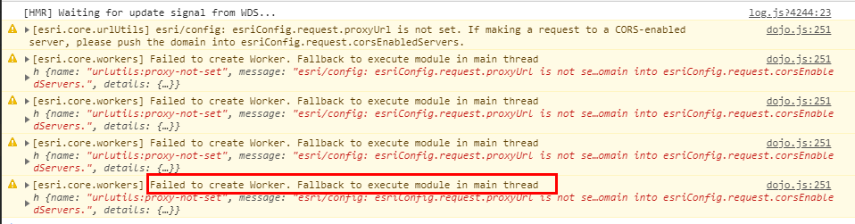

###vue + arcgis API for js V4.x 加载天地图/高德地图
* 说明 : 
	* 关于项目 : 纯前端实现,当然了,框架用的是vue,官方脚手架生成的项目目录;用到了ES2015 的知识.加载方法封装到了 `common.js` 中,不同的地图,切换不同的url即可,本项目不涉及arcgis for server.
	
	* 关于API : 本地用 tomcat 部署的API,在使用的时候控制台会打印关于`workers`的警告,切换到官网API的时候没有警告,不知是哪里的设置有问题,正在寻求解决中.
	
		
		
		* 关于这点 : 还是跨域的问题,把 `'http://localhost:8080/4.8/esri/core/workers/worker.js'` push 到 `esriConfig.request.corsEnabledServers`即可解决;
		
		* 顺便说一下,关于workers.js: js 是单线程的,当主线程上有任务在执行的时候,其他的任务处于等待的状态,这要效率会比较低 .所以,esri 引入了这个模块,估计目的是为了提高效率吧.官方的描述是: 
			>这个模块是一个实用的框架，它简化了用于JavaScript的ArcGIS API中的Web Workers的使用。workers框架利用多核cpu在后台线程中执行计算开销较大的任务，而不会干扰用户界面。这个框架使用Connection类加载一个脚本并在主线程中提供一个调用函数。然后可以使用连接将作业从主线程异步地卸载到worker上。一旦工作完成，workers框架将返回一个Promise。

		* 关于加载本地CSS,图标显示不正常的问题: 
		
		    这个时候,控制台往往会报错,还是跨域的错,这个时候,就是服务的锅了,就是部署API的服务的锅了,如果是windows 通过IIS 部署的,谷歌或者百度 关键字 `IIS 允许跨域`,添加相应的请求头就行了,以实测可行.还有就是,记得设置一下允许的文件类型,这个在安装说明的那个页面是有的,在页面上那个表格里面,对应的添加一下,安装说明在哪里? 在下载API的压缩包里面,`\arcgis_js_v48_api\arcgis_js_api\library\downloads\`的这里,有个`index.html`, windows 和 linux 都有对应的.如果是通过tomcat部署的,网上相应的解决方案一大堆,但是字体跨域的问题没解决.并且,官方推荐的windows 是通过 iis 安装,如果这个问题不能解决,那就用IIS 部署吧.
